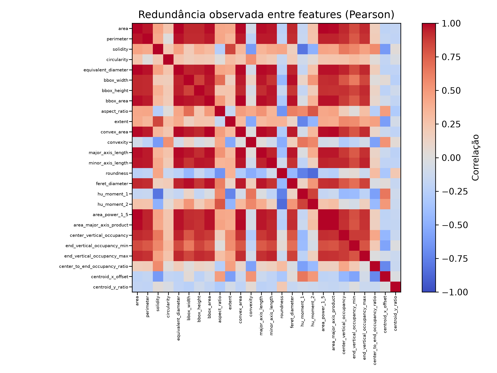
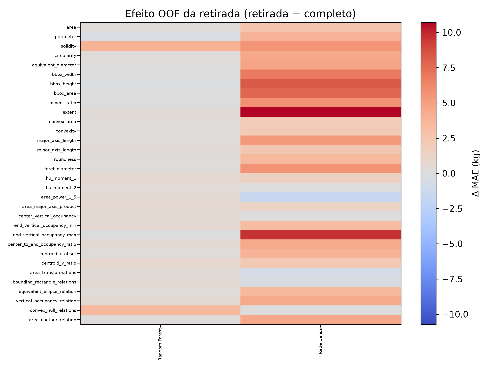
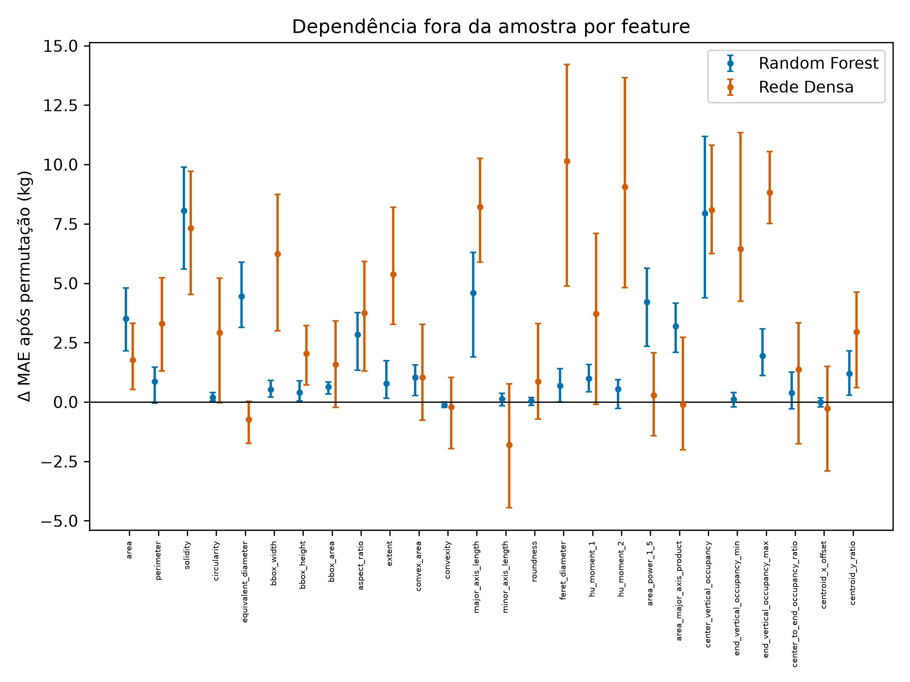

<!--
RASCUNHO EDITORIAL DO RELATÓRIO FINAL PIBIC

Este arquivo Markdown é a fonte textual do relatório. A diagramação institucional,
a paginação, as assinaturas e a inserção definitiva das figuras da Parte I serão
realizadas no Google Docs.

Regras editoriais adotadas:
- o conteúdo científico da Parte I foi preservado integralmente;
- as figuras da Parte I são representadas por marcadores de inserção;
- as figuras da Parte II são incorporadas por caminhos relativos quando disponíveis;
- resultados ainda não confirmados são marcados explicitamente como pendentes;
- a numeração definitiva de figuras e tabelas será ajustada no Google Docs.
-->

# RELATÓRIO FINAL PIBIC

**TÍTULO DO PROJETO DE PESQUISA:** Processamento de imagem para estimativa do peso de búfalo

**TÍTULO DO PLANO DE TRABALHO:** Avaliação do método de segmentação semântica por detecção de objeto saliente em imagens digitais de bubalinos

**DISCENTE:** Victor Alexandre Saraiva Pimentel

**ORIENTADOR:** Kleber Regis Santoro

**INSTITUIÇÃO:** Universidade Federal do Agreste de Pernambuco

**PERÍODO DE VIGÊNCIA:** [PENDENTE]

**LOCAL E ANO:** Garanhuns, 2026

<!-- Inserir sumário automático no Google Docs. -->

# 1 PARTE I — AVALIAÇÃO DO MÉTODO DE SEGMENTAÇÃO SEMÂNTICA POR DETECÇÃO DE OBJETO SALIENTE EM IMAGENS DIGITAIS DE BUBALINOS

## 1.1 INTRODUÇÃO

Este plano de trabalho insere-se na zootecnia de precisão e na visão computacional aplicada à produção animal, estando vinculado ao projeto “Predição do peso vivo e caracterização de búfalos da raça Murrah usando medidas corporais lineares”. A zootecnia de precisão busca ampliar o monitoramento automatizado e individualizado dos animais por meio de tecnologias digitais, incluindo abordagens baseadas em visão computacional (NORTON et al., 2019). Para automatizar com precisão a estimativa de peso e as medições biométricas por imagens digitais, é necessário isolar o animal do restante da cena, etapa central em sistemas de estimativa de peso baseados em imagem (DOHMEN; CATAL; LIU, 2022). Em imagens capturadas por smartphones em sistemas extensivos e semi-intensivos, essa etapa é dificultada por múltiplos búfalos, oclusões, ângulos extremos e, sobretudo, baixo contraste entre animal e fundo, tornando central a avaliação de métodos de segmentação semântica por detecção de objetos salientes, já que dela depende a qualidade da máscara usada nas etapas posteriores.

O problema de pesquisa consiste em identificar quais modelos pré-treinados apresentam melhor desempenho e estabilidade na segmentação de bubalinos em condições desafiadoras de campo, considerando a qualidade da máscara contínua e o efeito das etapas posteriores de binarização. Como há forte desbalanceamento de classes, com predominância de pixels de fundo, o estudo busca entender quais modelos e estratégias de processamento lidam melhor com essa assimetria sem perder definição de área e contorno do búfalo, já que métricas tradicionais podem se tornar pouco informativas nesse cenário (SAITO; REHMSMEIER, 2015). Parte-se da hipótese de que modelos treinados em bases amplas e generalistas possam adaptar-se melhor ao domínio agropecuário do que modelos voltados a nichos muito específicos.

O estudo foi organizado em duas frentes complementares: a avaliação da qualidade das máscaras contínuas produzidas pelos modelos e a análise do efeito da binarização e do pós-processamento sobre essas máscaras, considerando também as condições de dificuldade presentes nas imagens e os diferentes cenários analíticos do conjunto de dados. Assim, a pesquisa não busca apenas apontar um modelo vencedor, mas identificar quais modelos são mais robustos na segmentação bruta, quais estratégias de binarização melhor se ajustam a cada um e se as melhores combinações já atingem um patamar suficiente de qualidade para segmentação de búfalos em imagens de campo.

## 1.2 OBJETIVOS

### 1.2.1 Objetivo Geral

O objetivo geral desta pesquisa é avaliar arquiteturas pré-treinadas de segmentação semântica por detecção de objeto saliente em imagens digitais de bubalinos, considerando a qualidade da segmentação bruta e o efeito das estratégias de binarização, a fim de identificar as soluções mais robustas para isolar o animal do fundo em cenários reais de campo e viabilizar a extração futura de medidas corporais e a predição do peso vivo.

### 1.2.2 Objetivos Específicos

- Produzir ground truths manuais no GIMP, definindo com precisão a área e o contorno do animal para validar os modelos.
- Realizar a curadoria manual das imagens com tags de dificuldade, como baixo_contraste, ocluido, cortado, angulo_extremo e multi_bufalos, apoiando a análise do impacto dessas condições.
- Comparar modelos pré-treinados das famílias u2net, isnet, sam e birefnet na segmentação de imagens digitais de bubalinos.
- Avaliar estratégias de binarização e pós-processamento morfológico na conversão das máscaras probabilísticas em máscaras binárias finais.
- Calcular AUPRC, Soft Dice, Brier Score, IoU, Precision, Recall, Area Similarity e Perímetro Similarity.
- Medir a estabilidade e a reprodutibilidade da segmentação bruta em execuções repetidas.
- Analisar o impacto das tags de curadoria e comparar os resultados nos cenários de dataset completo, ideal e apenas ok.
- Verificar se as melhores combinações entre modelo e estratégia de binarização atingem qualidade suficiente ou ainda indicam necessidade de retreinamento específico.

## 1.3 FUNDAMENTAÇÃO TEÓRICA

### 1.3.1 Visão Computacional na Zootecnia de Precisão

A zootecnia de precisão busca otimizar a produção animal por meio de monitoramento automatizado e individualizado (NORTON et al., 2019). Nesse contexto, a biometria por imagem permite estimar o peso vivo de bubalinos sem conduzi-los a balanças físicas, reduzindo estresse, tempo e mão de obra, sendo a visão computacional uma abordagem promissora para esse tipo de estimativa em sistemas pecuários (DOHMEN; CATAL; LIU, 2022). Para isso, porém, o sistema computacional precisa delimitar corretamente o corpo do animal na imagem, separando-o de pastos, cercas e outros ruídos visuais.

### 1.3.2 Segmentação Semântica e Detecção de Objetos Salientes

Segmentação semântica é a tarefa de classificar cada pixel da imagem em categorias como búfalo ou fundo. Dentro desse campo, a Detecção de Objetos Salientes (Salient Object Detection - SOD) busca extrair o elemento visualmente mais relevante da cena. Arquiteturas como U²-Net (QIN et al., 2020), IS-Net (QIN et al., 2022), SAM (KIRILLOV et al., 2023) e BiRefNet (ZHENG et al., 2024) ampliaram a capacidade de segmentar objetos em contextos complexos ao combinar contexto global, necessário para reconhecer o animal, com detalhes locais, importantes para refinar bordas.

### 1.3.3 Desafios em Cenários de Campo e Desbalanceamento de Classes

Diferentemente de imagens obtidas em ambientes controlados, fotografias de sistemas extensivos e semi-intensivos apresentam ruídos severos, como baixo contraste entre animal e fundo, oclusões, ângulos extremos e presença de múltiplos indivíduos, características compatíveis com os desafios já descritos para aplicações de visão computacional em contextos pecuários reais (DOHMEN; CATAL; LIU, 2022). Além disso, há forte desbalanceamento de classes, pois os pixels do búfalo ocupam parcela muito menor da imagem que os do cenário. Nessa situação, métricas tradicionais como acurácia tornam-se insuficientes, já que um modelo pode parecer bom ao classificar quase tudo como fundo e ainda falhar no objetivo principal da segmentação (SAITO; REHMSMEIER, 2015).

Por isso, métricas mais sensíveis à classe positiva, como AUPRC e Soft Dice, tornam-se mais informativas nesse contexto, pois avaliam com maior precisão a capacidade do modelo de recuperar o objeto de interesse mesmo quando o fundo domina a maior parte da imagem (SAITO; REHMSMEIER, 2015; MILLETARI; NAVAB; AHMADI, 2016).

### 1.3.4 Avaliação de Segmentação Bruta (Escores Probabilísticos)

Modelos de detecção de objetos salientes produzem inicialmente máscaras contínuas em escala de cinza, nas quais a intensidade de cada pixel representa a confiança de pertencer ao objeto de interesse: valores próximos de preto indicam fundo, próximos de branco indicam animal e tons intermediários representam incerteza. Para avaliar essa saída antes da aplicação de limiares, os valores são normalizados entre 0 e 1 e analisados por métricas adequadas ao desbalanceamento de classes: AUPRC, que mede a capacidade de priorizar pixels positivos em cenários desbalanceados (SAITO; REHMSMEIER, 2015); Soft Dice, que avalia a sobreposição suave entre predição e ground truth (MILLETARI; NAVAB; AHMADI, 2016); e Brier Score, que quantifica o erro quadrático médio entre a confiança predita e o valor real (BRIER, 1950).

### 1.3.5 Binarização, Pós-processamento e Métricas Finais

Para uso nas etapas posteriores de biometria, a máscara contínua deve ser convertida em máscara binária, atribuindo valor máximo aos pixels do animal e zero ao fundo. Esse processo de limiarização pode introduzir ruídos, descontinuidades e bordas serrilhadas, motivo pelo qual se aplicam filtros e operações morfológicas, como suavização gaussiana, abertura e fechamento. Entre os métodos de limiarização, o procedimento de Otsu destaca-se por estimar automaticamente o limiar a partir da distribuição dos níveis de cinza da imagem (OTSU, 1979). Neste projeto, a binarização é parte da própria avaliação, pois pode preservar ou degradar o potencial da máscara contínua. Por isso, as máscaras finais são comparadas ao ground truth por IoU, Precision, Recall, Area Similarity e Perímetro Similarity, permitindo avaliar tanto a sobreposição espacial quanto a preservação de área e contorno, aspecto crítico para medições corporais em bubalinos (TAHA; HANBURY, 2015).

Cada uma dessas métricas destaca uma dimensão específica da qualidade da segmentação final. A IoU mede a sobreposição entre a máscara predita e o ground truth, sintetizando o quanto ambas coincidem espacialmente. A Precision indica o quanto dos pixels classificados como animal realmente pertencem ao animal, sendo sensível a falsos positivos. A Recall mostra o quanto da área real do búfalo foi recuperada pela segmentação, sendo sensível a falsos negativos. A Area Similarity avalia a preservação da área global do objeto segmentado, enquanto a Perímetro Similarity observa o quanto o contorno final se mantém compatível com o da referência manual. Em conjunto, essas métricas permitem avaliar não apenas se a segmentação encontra o animal, mas também se o faz com fidelidade geométrica suficiente para aplicações biométricas posteriores (TAHA; HANBURY, 2015).

## 1.4 METODOLOGIA

Trata-se de um estudo quantitativo e experimental em visão computacional, voltado à avaliação de modelos pré-treinados de segmentação semântica por detecção de objetos salientes para isolar bubalinos do fundo em fotografias de campo. A base reúne imagens .jpg capturadas por smartphones de búfalos da raça Murrah em sistemas extensivos e semi-intensivos de Pernambuco. A amostra analisada nesta etapa foi composta por 387 imagens, todas compatíveis com o recorte do estudo e com as condições de campo investigadas. Nesta etapa, realizou-se a curadoria manual da base por meio de interfaces em Python com tkinter, com atribuição das tags multi_bufalos, cortado, angulo_extremo, baixo_contraste e ocluido, além da criação do ground truth por segmentação manual no GIMP (THE GIMP DEVELOPMENT TEAM, 2026).

O processamento foi automatizado em um pipeline em Python responsável pela inferência dos modelos, binarização das máscaras, cálculo das métricas e organização das saídas analíticas (PIMENTEL, 2026). A geração das máscaras preditivas foi feita com apoio da biblioteca rembg, usada como interface para modelos pré-treinados das famílias u2net, isnet, sam, silueta e birefnet (GATIS, 2025). As máscaras contínuas foram então submetidas a quatro estratégias de binarização e refinamento: Limiar Fixo, Otsu, Gaussian Opening e Hysteresis Closing. No Limiar Fixo, classificaram-se como pertencentes ao búfalo os pixels com valor igual ou superior a 0,5. No método de Otsu, esse limiar é estimado automaticamente a partir da distribuição dos tons de cinza da própria máscara (OTSU, 1979). Já as estratégias com Gaussian Opening e Hysteresis Closing incorporam etapas adicionais de suavização e refinamento estrutural, buscando reduzir ruídos, pequenos fragmentos indevidos e irregularidades nas bordas. As configurações denominadas como Alta e Baixa correspondem a parametrizações distintas dessas estratégias, representando versões mais conservadoras ou mais permissivas no processo de binarização e pós-processamento, de modo a verificar como diferentes níveis de rigidez afetam a preservação da área e do contorno do animal. De modo geral, as configurações Baixa tendem a operar com critérios menos restritivos, favorecendo maior recuperação da área do objeto, enquanto as configurações Alta tendem a impor critérios mais rigorosos de separação e refinamento, o que pode reduzir ruídos, mas também aumentar o risco de perda de partes válidas do animal. A comparação entre essas variantes permitiu avaliar o equilíbrio entre preservação estrutural e limpeza da máscara final.

Para preservar a fidelidade do contorno manual de referência, o ground truth não recebeu pós-processamento morfológico, sendo convertido apenas por uma estratégia fixa de limiarização. O ground truth foi mantido o mais próximo possível da anotação manual original, pois sua função metodológica é servir como referência estável para a avaliação dos modelos, e não como resultado a ser refinado por processamento. A aplicação de operações morfológicas nessa máscara poderia alterar artificialmente propriedades geométricas relevantes, como área, contorno e sobreposição, comprometendo a comparabilidade com as saídas preditivas. Por essa razão, o pós-processamento foi restrito às máscaras geradas pelos modelos, enquanto o ground truth recebeu apenas a conversão binária necessária à padronização da referência.

Com base nas tags, a análise foi organizada nos cenários dataset completo, ideal e apenas ok. Após a verificação de estabilidade, adotou-se uma execução fixa configurável para a etapa binarizada, e os resultados foram armazenados em SQLite. Ao final, as combinações mais promissoras foram validadas por thresholds absolutos nas métricas da segmentação binarizada.

## 1.5 RESULTADOS E DISCUSSÃO / DESENVOLVIMENTO DO TRABALHO

### 1.5.1 Impacto das Tags de Dificuldade nos Resultados

Esta subseção analisa como as tags de curadoria afetam a segmentação bruta e binarizada. As tags descrevem dificuldades visuais da cena: baixo_contraste, angulo_extremo, cortado, multi_bufalos, ocluido e ok. Sua leitura permite identificar não apenas o desempenho médio dos modelos e estratégias, mas também em quais condições ele se degrada.

<!-- FIGURA P1-01
Inserir a Figura 1 do relatório parcial.
Legenda original: Figura 1 - Interação entre modelo e tags de dificuldade na métrica AUPRC.
Fonte original: Elaborado pelo autor com base nos dados da pesquisa (2026).
-->

<!-- FIGURA P1-02
Inserir a Figura 2 do relatório parcial.
Legenda original: Figura 2 - Interação entre modelo e tags de dificuldade na métrica Soft Dice.
Fonte original: Elaborado pelo autor com base nos dados da pesquisa (2026).
-->

<!-- FIGURA P1-03
Inserir a Figura 3 do relatório parcial.
Legenda original: Figura 3 - Interação entre modelo e tags de dificuldade na métrica Brier Score.
Fonte original: Elaborado pelo autor com base nos dados da pesquisa (2026).
-->

<!-- FIGURA P1-04
Inserir a Figura 4 do relatório parcial.
Legenda original: Figura 4 - Interação entre estratégia de binarização e tags de dificuldade na métrica Precision.
Fonte original: Elaborado pelo autor com base nos dados da pesquisa (2026).
-->

<!-- FIGURA P1-05
Inserir a Figura 5 do relatório parcial.
Legenda original: Figura 5 - Interação entre estratégia de binarização e tags de dificuldade na métrica Recall.
Fonte original: Elaborado pelo autor com base nos dados da pesquisa (2026).
-->

<!-- FIGURA P1-06
Inserir a Figura 6 do relatório parcial.
Legenda original: Figura 6 - Interação entre estratégia de binarização e tags de dificuldade na métrica de similaridade de área.
Fonte original: Elaborado pelo autor com base nos dados da pesquisa (2026).
-->

<!-- FIGURA P1-07
Inserir a Figura 7 do relatório parcial.
Legenda original: Figura 7 - Interação entre estratégia de binarização e tags de dificuldade na métrica IoU.
Fonte original: Elaborado pelo autor com base nos dados da pesquisa (2026).
-->

<!-- FIGURA P1-08
Inserir a Figura 8 do relatório parcial.
Legenda original: Figura 8 - Interação entre estratégia de binarização e tags de dificuldade na métrica de similaridade de perímetro.
Fonte original: Elaborado pelo autor com base nos dados da pesquisa (2026).
-->

Na segmentação bruta, as métricas AUPRC, Soft Dice e Brier Score mostraram impacto negativo consistente de baixo_contraste, multi_bufalos e ocluido, coerente com a maior dificuldade de separar objeto e fundo, reduzir ambiguidades e preservar contornos. Já angulo_extremo e cortado não apresentaram deterioração suficientemente consistente para justificar sua exclusão do cenário ideal. Na segmentação binarizada, IoU, Precision, Recall, Area Similarity e Perímetro Similarity mantiveram o mesmo padrão geral, embora com intensidade variável entre métricas. Com base nesses resultados, definiram-se três cenários analíticos: dataset completo; cenário ideal, que mantém imagens ok, angulo_extremo e cortado; e cenário apenas ok, restrito às imagens sem dificuldades anotadas.

### 1.5.2 Estabilidade entre Execuções da Segmentação Bruta

<!-- FIGURA P1-09
Inserir a Figura 9 do relatório parcial.
Legenda original: Figura 9 - Estabilidade entre execuções dos modelos de segmentação bruta em AUPRC.
Fonte original: Elaborado pelo autor com base nos dados da pesquisa (2026).
-->

<!-- FIGURA P1-10
Inserir a Figura 10 do relatório parcial.
Legenda original: Figura 10 - Estabilidade entre execuções dos modelos de segmentação bruta em Soft Dice.
Fonte original: Elaborado pelo autor com base nos dados da pesquisa (2026).
-->

<!-- FIGURA P1-11
Inserir a Figura 11 do relatório parcial.
Legenda original: Figura 11 - Estabilidade entre execuções dos modelos de segmentação bruta em Brier Score.
Fonte original: Elaborado pelo autor com base nos dados da pesquisa (2026).
-->

Antes de comparar modelos e estratégias de binarização, verificou-se a estabilidade entre execuções da segmentação bruta por meio do coeficiente de variação entre execuções (cv_execucoes). Os resultados mostraram valores nulos ou residuais em AUPRC, Soft Dice e Brier Score, mesmo nos casos de maior dispersão, indicando elevada repetibilidade experimental. Assim, as diferenças entre modelos refletem seu comportamento intrínseco, e não flutuações relevantes do processo, o que justifica o uso de uma execução fixa nas análises posteriores.

### 1.5.3 Desempenho dos Modelos na Segmentação Bruta

<!-- FIGURA P1-12
Inserir a Figura 12 do relatório parcial.
Legenda original: Figura 12 - Ranking geral dos modelos de segmentação bruta nos cenários dataset completo, cenário ideal e apenas ok.
Fonte original: Elaborado pelo autor com base nos dados da pesquisa (2026).
-->

Com as dificuldades relevantes identificadas e a estabilidade confirmada, comparou-se o desempenho dos modelos na segmentação bruta nos cenários dataset completo, ideal e apenas ok, usando ranking multivariado baseado em AUPRC, Soft Dice e Brier Score, sintetizado pelo mean_rank. No dataset completo, destacaram-se birefnet-general e birefnet-hrsod, seguidos por outras variantes BiRefNet, isnet-general-use e u2netp, enquanto sam e isnet-anime ficaram nas últimas posições. No cenário ideal e no cenário apenas ok, birefnet-hrsod assumiu e manteve a liderança, indicando maior consistência em condições favoráveis, enquanto birefnet-general permaneceu altamente competitivo, sobretudo no dataset completo. Em conjunto, os resultados mostram que a família BiRefNet concentrou os melhores desempenhos da segmentação bruta e fundamenta a análise da etapa binarizada.

### 1.5.4 Desempenho das Estratégias na Segmentação Binarizada

<!-- FIGURA P1-13
Inserir a Figura 13 do relatório parcial.
Legenda original: Figura 13 - Melhor binarização por modelo no cenário do dataset completo.
Fonte original: Elaborado pelo autor com base nos dados da pesquisa (2026).
-->

<!-- FIGURA P1-14
Inserir a Figura 14 do relatório parcial.
Legenda original: Figura 14 - Melhor binarização por modelo no cenário ideal.
Fonte original: Elaborado pelo autor com base nos dados da pesquisa (2026).
-->

<!-- FIGURA P1-15
Inserir a Figura 15 do relatório parcial.
Legenda original: Figura 15 - Melhor binarização por modelo no cenário de apenas ok.
Fonte original: Elaborado pelo autor com base nos dados da pesquisa (2026).
-->

<!-- FIGURA P1-16
Inserir a Figura 16 do relatório parcial.
Legenda original: Figura 16 - Top 15 combinações modelo + estratégia nos cenários dataset completo, cenário ideal e apenas ok.
Fonte original: Elaborado pelo autor com base nos dados da pesquisa (2026).
-->

Após a segmentação bruta, investigou-se como a binarização afeta o desempenho final, buscando a melhor estratégia para cada modelo nos cenários dataset completo, ideal e apenas ok. O ranking multivariado foi construído com IoU, Precision, Recall, Area Similarity e Perímetro Similarity. Os heatmaps mostram que a melhor binarização varia conforme o modelo: no dataset completo, LimiarFixoBaixa predominou entre os modelos mais fortes, como birefnet-general, birefnet-hrsod, birefnet-massive, birefnet-portrait e silueta; HistereseClosingBaixa e HistereseClosingAlta também se destacaram em casos específicos; e OtsuOpeningBaixa/Alta apareceram mais em modelos como isnet-anime, u2net_human_seg e u2netp. No cenário ideal, LimiarFixoBaixa se consolidou entre várias variantes de BiRefNet, enquanto HistereseClosingBaixa favoreceu birefnet-general-lite e birefnet-massive, e HistereseClosingAlta favoreceu isnet-general-use. No cenário apenas ok, LimiarFixoBaixa tornou-se ainda mais frequente entre os modelos mais bem posicionados, enquanto OtsuOpeningAlta apareceu mais em modelos intermediários ou fracos. O top 15 de combinações modelo + estratégia confirma que as melhores posições se concentram nos modelos já fortes na etapa bruta, especialmente birefnet-general e birefnet-hrsod. Assim, não há uma estratégia universalmente ótima: o desempenho final depende da compatibilidade entre o perfil de saída do modelo e a binarização adotada.

### 1.5.5 Validação Final dos Melhores Resultados

<!-- FIGURA P1-17
Inserir a Figura 17 do relatório parcial.
Legenda original: Figura 17 - Desempenho médio das combinações finalistas nas métricas da segmentação binarizada.
Fonte original: Elaborado pelo autor com base nos dados da pesquisa (2026).
-->

<!-- FIGURA P1-18
Inserir a Figura 18 do relatório parcial.
Legenda original: Figura 18 - Aprovação das combinações finalistas nos thresholds configurados para a validação final.
Fonte original: Elaborado pelo autor com base nos dados da pesquisa (2026).
-->

Na validação final, selecionaram-se os três modelos mais bem posicionados na segmentação bruta do cenário apenas ok — birefnet-hrsod, birefnet-general e birefnet-massive — e, para cada um, a melhor estratégia de binarização no mesmo cenário, que foi LimiarFixoBaixa nos três casos. As combinações foram avaliadas por thresholds absolutos de IoU (>= 0,97), Precision (>= 0,99), Recall (>= 0,985), Area Similarity (>= 0,99) e Perímetro Similarity (>= 0,96), definidos como critério rigoroso de suficiência. Como todas atenderam simultaneamente a esses limites, conclui-se que, no recorte mais favorável, o pipeline já produz segmentações de alta qualidade, sem evidência imediata de necessidade de retreinamento específico, embora essa possibilidade possa ser revista em etapas futuras mais exigentes.

## 1.6 CONSIDERAÇÕES FINAIS DA PARTE I

Os resultados desta etapa indicam que os objetivos do plano de trabalho foram alcançados. Foi estruturado um pipeline completo de avaliação para segmentação de bubalinos em imagens de campo, desde a produção do ground truth manual até a comparação de modelos de segmentação bruta, estratégias de binarização e critérios finais de validação. Na segmentação bruta, destacou-se um grupo superior liderado por variantes da família BiRefNet, especialmente birefnet-hrsod, birefnet-general e birefnet-massive, além de se confirmar a estabilidade do pipeline e o impacto negativo consistente de baixo_contraste, multi_bufalos e ocluido. Na segmentação binarizada, verificou-se que a melhor estratégia depende da interação entre o modelo e a distribuição de scores, embora LimiarFixoBaixa tenha se destacado entre os modelos mais fortes. Por fim, a validação final mostrou que os três melhores modelos no cenário apenas ok, combinados com sua melhor binarização, atenderam aos thresholds absolutos definidos, indicando que o pipeline já alcança alto padrão de qualidade nesse recorte, sem evidência imediata de necessidade de retreinamento específico.

## 1.7 DIFICULDADES ENCONTRADAS NA PARTE I

Durante esta etapa, as principais dificuldades foram a construção do ground truth, a curadoria manual das imagens, o custo computacional do pipeline e a escala combinatória da análise binarizada. A segmentação manual das máscaras de referência e o tagging das dificuldades visuais demandaram tempo e cuidado, pois afetam diretamente a confiabilidade das métricas e a interpretação estatística. Além disso, a execução dos modelos, a geração das máscaras, a binarização, o recálculo das métricas e as execuções múltiplas exigiram processamento significativo, impactando o ritmo de experimentação. Na segmentação binarizada, a combinação entre múltiplos modelos, estratégias e execuções elevou rapidamente o custo analítico, exigindo adaptações metodológicas, como o uso de uma execução fixa configurável e a reorganização dos artefatos analíticos. Essas dificuldades não impediram o avanço do trabalho, mas influenciaram diretamente a organização metodológica adotada.

# 2 PARTE II — PREDIÇÃO DO PESO VIVO DE BUBALINOS A PARTIR DE MÁSCARAS BINÁRIAS

<!--
A Parte II será redigida progressivamente conforme as etapas experimentais forem confirmadas.
Não substituir marcadores pendentes por resultados preliminares sem evidência confirmada.
-->

## 2.1 INTRODUÇÃO

O acompanhamento do peso vivo é relevante para o manejo produtivo, nutricional e sanitário dos animais, mas a obtenção frequente dessa medida por balanças pode demandar infraestrutura, contenção e deslocamento. Nesse contexto, métodos baseados em imagens têm sido investigados como uma forma de estimar o peso a partir de características corporais observáveis, integrando-se à perspectiva de monitoramento automatizado na pecuária de precisão (NORTON et al., 2019; DOHMEN; CATAL; LIU, 2022).

A Parte I deste trabalho concentrou-se na obtenção de máscaras binárias capazes de representar adequadamente a silhueta dos bubalinos. A etapa atual utiliza essas máscaras como entrada para investigar uma questão diferente: quanto da informação necessária para estimar o peso permanece disponível quando a fotografia é reduzida à forma projetada do animal. A máscara preserva área, contorno, proporções e distribuição espacial da silhueta, ao mesmo tempo em que reduz a influência de fundo, iluminação, cor e textura. Em contrapartida, elimina características internas de aparência e não fornece escala física por si só. Dessa forma, as medidas obtidas em pixels devem ser interpretadas como descrições da geometria aparente sob o protocolo de aquisição utilizado, e não como medidas corporais absolutas.

Para explorar essa representação, foram definidas duas famílias de abordagem. A primeira utiliza descritores geométricos e espaciais calculados explicitamente a partir das máscaras e posteriormente fornecidos a modelos de regressão, como Random Forest e rede neural densa. A segunda utiliza redes neurais convolucionais, representadas por uma CNN compacta treinada do zero e por uma ResNet-18 pré-treinada, permitindo que relações espaciais sejam aprendidas diretamente da imagem binária. A comparação sob um mesmo particionamento experimental busca avaliar o potencial relativo dessas estratégias sem pressupor previamente qual delas é superior.

Diante desse recorte, a Parte II é orientada pela seguinte pergunta de pesquisa: em que medida as informações geométricas e espaciais preservadas nas máscaras binárias permitem estimar o peso vivo dos bubalinos, e qual das abordagens avaliadas apresenta maior potencial preditivo sob o protocolo experimental adotado?

## 2.2 OBJETIVOS

### 2.2.1 Objetivo Geral

Comparar abordagens baseadas em descritores geométricos e redes convolucionais, sob um mesmo protocolo experimental, para identificar qual apresenta maior potencial para estimar o peso vivo de bubalinos a partir de máscaras binárias.

### 2.2.2 Objetivos Específicos

- Organizar e validar a amostra de máscaras binárias associadas aos pesos dos animais.
- Extrair e avaliar descritores geométricos e espaciais das máscaras.
- Comparar o desempenho de Random Forest, rede neural densa, CNN compacta e ResNet-18 pré-treinada sob o mesmo protocolo experimental.
- Selecionar um conjunto de atributos para as abordagens baseadas em descritores.
- Identificar a abordagem com maior potencial preditivo entre as alternativas avaliadas.
- Avaliar variantes pré-registradas da abordagem selecionada.
- Analisar os padrões de erro, a sensibilidade e as limitações do estudo.

## 2.3 FUNDAMENTAÇÃO TEÓRICA

### 2.3.1 Predição de Peso por Imagens Digitais

A estimativa de peso por imagens busca relacionar características visuais da conformação corporal com uma variável contínua de interesse, reduzindo a necessidade de contenção frequente do animal e de uso permanente de balanças. Diferentes estudos utilizaram imagens bidimensionais, sensores de profundidade ou reconstruções tridimensionais para obter medidas biométricas e, posteriormente, ajustar modelos de regressão. Em bovinos Nelore, Cominotte et al. (2023) avaliaram medidas extraídas de imagens tridimensionais para predizer peso corporal e peso de carcaça. Lee, Lee e Cho (2023), por sua vez, estimaram o peso a partir de características obtidas de máscaras de segmentação geradas sobre imagens bidimensionais. Afridi et al. (2024) também demonstraram que a modalidade de entrada — imagem original, região do animal ou representação segmentada — altera as informações disponibilizadas aos modelos de aprendizado profundo.

Nesse contexto, a máscara binária funciona como uma representação intermediária entre a fotografia e o modelo preditivo. Ela preserva a área projetada, o contorno, as proporções e a distribuição espacial da silhueta, enquanto reduz interferências de fundo, cor, iluminação e textura. Essa simplificação permite investigar especificamente quanto da variação do peso pode ser explicada pela geometria aparente do animal. Em contrapartida, a máscara descarta informações internas de aparência e não fornece, por si só, escala física. Distância da câmera, perspectiva e postura podem modificar a geometria projetada; por isso, a padronização em pixels torna os arquivos computacionalmente comparáveis, mas não converte as medidas em unidades corporais reais. As conclusões devem, portanto, permanecer condicionadas ao protocolo de aquisição e à amostra utilizada.

### 2.3.2 Descritores Geométricos de Máscaras Binárias

Descritores geométricos transformam a silhueta binária em um vetor numérico que pode ser utilizado por modelos de regressão. Medidas de área, perímetro, largura, altura, eixos da elipse equivalente e diâmetro de Feret representam dimensões projetadas do corpo. Razões como circularidade, solidez, convexidade, extensão e proporção do retângulo delimitador descrevem propriedades da forma com menor dependência direta do tamanho. Medidas baseadas no centroide e na ocupação de diferentes regiões acrescentam informação sobre como a massa projetada se distribui ao longo da silhueta.

Os momentos invariantes propostos por Hu (1962) constituem uma forma clássica de resumir propriedades globais de uma figura, com invariância teórica a transformações como translação, rotação e mudança uniforme de escala. No presente estudo, os dois primeiros momentos de Hu complementam as medidas diretamente interpretáveis de tamanho e contorno. Entretanto, vários descritores podem possuir relações matemáticas ou correlações elevadas: diâmetro equivalente deriva da área, área do retângulo deriva de largura e altura, e diferentes proxies volumétricos reutilizam medidas de tamanho. A análise de redundância é, portanto, necessária para evitar que múltiplas variáveis representem essencialmente a mesma informação sem benefício preditivo demonstrável.

### 2.3.3 Aprendizado de Máquina para Regressão

Na regressão supervisionada, um modelo aprende uma função que relaciona variáveis de entrada a um alvo numérico contínuo. Neste trabalho, os descritores geométricos formam os vetores de entrada e o peso vivo, expresso em quilogramas, constitui a variável-alvo. A comparação entre métodos distintos permite verificar se a relação entre forma e peso é mais bem representada por partições baseadas em árvores ou por combinações não lineares aprendidas por redes neurais.

O Random Forest combina diversas árvores construídas com aleatoriedade nos dados e nos atributos, agregando suas estimativas para produzir a predição final. O método pode representar relações não lineares e interações sem exigir a definição prévia de uma equação funcional específica (BREIMAN, 2001). A rede neural densa, por outro lado, aplica sucessivas transformações lineares e funções de ativação aos descritores. Redes feedforward com unidades suficientes possuem capacidade teórica de aproximar ampla classe de funções (HORNIK; STINCHCOMBE; WHITE, 1989). Essa flexibilidade não implica superioridade automática: em amostras pequenas, modelos mais flexíveis também podem ajustar variações particulares dos dados. Por essa razão, as abordagens devem ser avaliadas sob os mesmos folds e critérios, sem presumir antecipadamente qual delas será melhor.

### 2.3.4 Redes Neurais Convolucionais e Transferência de Aprendizado

Redes neurais convolucionais processam imagens por meio de filtros locais com pesos compartilhados, formando representações hierárquicas da estrutura espacial. Essa organização é adequada para padrões bidimensionais porque preserva relações de vizinhança e reduz a necessidade de transformar previamente a imagem em um conjunto fixo de medidas. O trabalho de LeCun et al. (1998) consolidou o uso de convoluções e treinamento por gradiente para reconhecimento de padrões visuais. Aplicadas às máscaras binárias, essas redes podem aprender diretamente combinações de contorno, proporção e ocupação espacial que não estejam explicitamente codificadas nos descritores manuais.

A CNN compacta treinada do zero permite avaliar essa aprendizagem direta com uma arquitetura de menor complexidade. A ResNet-18 representa uma alternativa mais profunda baseada em conexões residuais, nas quais blocos aprendem modificações em relação às suas entradas; essa formulação foi proposta para facilitar a otimização de redes profundas (HE et al., 2016). Quando inicializada com pesos aprendidos previamente em uma base ampla, a rede utiliza transferência de aprendizado. Yosinski et al. (2014) observaram que camadas iniciais tendem a aprender características mais gerais, enquanto camadas superiores se tornam mais específicas à tarefa original. Contudo, a distância entre fotografias naturais e máscaras binárias cria uma diferença de domínio relevante. Assim, o benefício da inicialização pré-treinada deve ser tratado como questão experimental, e não como garantia de melhor desempenho.

### 2.3.5 Avaliação Preditiva e Validação Cruzada

A validação cruzada divide a amostra em subconjuntos alternadamente utilizados para ajuste e avaliação, permitindo que cada observação seja predita por uma instância que não a utilizou no próprio treinamento. O princípio de avaliação cruzada de procedimentos preditivos foi formalizado por Stone (1974). No protocolo adotado, as predições fora do fold, ou *out-of-fold* (OOF), são reunidas para produzir uma avaliação sobre as 132 observações, mantendo a separação entre o treino de cada instância e seu respectivo subconjunto de avaliação. O compartilhamento da mesma divisão entre os modelos reduz a influência do particionamento sobre a comparação.

O erro absoluto médio, ou MAE, expressa a média das diferenças absolutas entre pesos observados e preditos. Como permanece na unidade original do alvo, seu resultado pode ser interpretado diretamente em quilogramas. Willmott e Matsuura (2005) destacam o MAE como uma medida não ambígua do erro médio, enquanto métricas quadráticas atribuem peso desproporcional aos maiores desvios. Métricas secundárias podem complementar a análise, mas o MAE OOF constitui a evidência comparativa principal deste estudo.

É necessário distinguir avaliação fora do fold de validação externa. Quando os mesmos dados participam, ainda que indiretamente, da escolha de atributos, da seleção de abordagem ou do ajuste de configurações, a estimativa final pode favorecer o procedimento selecionado. Cawley e Talbot (2010) mostram que a otimização de critérios de seleção pode introduzir viés na avaliação subsequente. Por isso, os resultados OOF posteriores às decisões de desenvolvimento serão apresentados como evidência interna do experimento, e não como demonstração independente de desempenho em novos animais.

## 2.4 METODOLOGIA

### 2.4.1 Delineamento do Estudo e Origem das Máscaras

A amostra desta etapa foi composta por 132 máscaras binárias associadas a pesos vivos válidos. Essas máscaras correspondem ao subconjunto das 387 imagens avaliadas na Parte I que recebeu validação manual com a tag `ok`, isto é, sem dificuldades visuais anotadas que pudessem comprometer de forma evidente a delimitação do animal. O uso desse recorte buscou reduzir a possibilidade de que falhas de segmentação, como inclusão relevante de fundo, perda de partes do corpo, oclusões ou presença de múltiplos animais, fossem confundidas com limitações dos modelos de predição de peso.

As 132 máscaras foram produzidas pelo pipeline selecionado na etapa anterior, baseado no modelo `birefnet-general` combinado à estratégia `LimiarFixoBaixa`, e pertencem aos grupos `Fotos 2` e `Fotos 3`. Esses grupos seguiram as recomendações de distância e posicionamento da câmera durante a aquisição, ao contrário do grupo inicial `Fotos 1`, considerado menos confiável quanto a esses critérios. Além disso, cada máscara dos grupos selecionados possuía associação rastreável com o respectivo peso vivo do animal, condição necessária para o treinamento supervisionado dos modelos.

Os grupos `Fotos 2` e `Fotos 3` correspondem a fazendas distintas. Essa origem foi preservada no índice de máscaras para permitir a análise de possíveis efeitos de procedência. Como os animais da categoria de maior peso se concentram em uma das fazendas, fazenda e extremo de peso estão parcialmente confundidos na amostra, limitação considerada na interpretação dos resultados.

### 2.4.2 Padronização das Máscaras

Todas as máscaras foram padronizadas para uma resolução canônica em que o maior lado possui 1024 pixels, mantendo-se a razão de aspecto original. Essa normalização torna comparáveis as medidas de área, comprimento e proporção extraídas de arquivos com diferentes dimensões, evitando que diferenças de resolução sejam interpretadas pelos modelos como diferenças corporais. A preservação da razão de aspecto impede deformações da silhueta durante o redimensionamento. Após essa etapa, a representação binária padronizada foi utilizada tanto na extração dos atributos geométricos quanto como entrada dos modelos convolucionais.

### 2.4.3 Categorias de Peso e Divisão Experimental

Para apoiar a construção de partições mais equilibradas, os pesos foram organizados em dez categorias, denominadas B1 a B10, definidas a partir de quantis globais da distribuição de peso. Essas categorias foram utilizadas somente como estratos auxiliares na divisão dos dados, buscando distribuir animais leves, intermediários e pesados entre os cinco folds. A tarefa permaneceu sendo de regressão, tendo como variável-alvo o peso vivo contínuo, expresso em quilogramas.

Foi adotado um único particionamento canônico em cinco folds, gerado com a seed 42 e compartilhado por todas as abordagens. O uso dos mesmos folds permite comparar os modelos sob condições equivalentes e reduz a possibilidade de que diferenças de desempenho sejam causadas por divisões distintas da amostra. Em cada rodada da validação cruzada, o modelo foi treinado em quatro folds e avaliado no fold restante, preservando a separação entre treino e avaliação e evitando o uso da observação avaliada no ajuste da respectiva instância do modelo.

### 2.4.4 Extração de Atributos Geométricos e Espaciais

A partir de cada máscara binária padronizada, foram calculados 26 atributos candidatos destinados a representar dimensões de tamanho, forma, contorno, distribuição espacial e proxies volumétricos da silhueta. Os identificadores foram mantidos conforme utilizados no pipeline computacional para garantir correspondência direta entre o relatório e os artefatos reprodutíveis do projeto.

| Grupo | Atributo | Descrição |
|---|---|---|
| Tamanho e escala | `area` | Número de pixels pertencentes à silhueta do animal. |
| Tamanho e escala | `perimeter` | Comprimento do contorno externo da máscara. |
| Tamanho e escala | `equivalent_diameter` | Diâmetro do círculo com área equivalente à área da máscara. |
| Tamanho e escala | `bbox_width` | Largura do menor retângulo alinhado aos eixos que contém a silhueta. |
| Tamanho e escala | `bbox_height` | Altura do menor retângulo alinhado aos eixos que contém a silhueta. |
| Tamanho e escala | `bbox_area` | Área do retângulo delimitador, calculada pelo produto entre largura e altura. |
| Tamanho e escala | `convex_area` | Área do fecho convexo da silhueta. |
| Tamanho e escala | `major_axis_length` | Comprimento do eixo principal da elipse equivalente à distribuição da máscara. |
| Tamanho e escala | `minor_axis_length` | Comprimento do eixo secundário da elipse equivalente. |
| Tamanho e escala | `feret_diameter` | Maior distância entre dois pontos do fecho convexo da silhueta. |
| Forma e contorno | `solidity` | Razão entre a área da máscara e a área do seu fecho convexo. |
| Forma e contorno | `circularity` | Medida que relaciona área e perímetro para quantificar a proximidade da forma com um círculo. |
| Forma e contorno | `aspect_ratio` | Razão entre a largura e a altura do retângulo delimitador. |
| Forma e contorno | `extent` | Proporção do retângulo delimitador ocupada pela silhueta. |
| Forma e contorno | `convexity` | Relação entre o perímetro convexo e o perímetro observado da máscara. |
| Forma e contorno | `roundness` | Medida de arredondamento calculada a partir da área e do eixo principal. |
| Momentos de forma | `hu_moment_1` | Primeiro momento invariante de Hu, utilizado para representar propriedades globais da forma. |
| Momentos de forma | `hu_moment_2` | Segundo momento invariante de Hu, complementar na descrição global da silhueta. |
| Proxies volumétricos | `area_power_1_5` | Área elevada à potência 1,5, utilizada como aproximação alométrica de volume. |
| Proxies volumétricos | `area_major_axis_product` | Produto entre a área da máscara e o comprimento do eixo principal. |
| Distribuição espacial | `center_vertical_occupancy` | Ocupação vertical média no terço central da silhueta ao longo do eixo horizontal. |
| Distribuição espacial | `end_vertical_occupancy_min` | Menor ocupação vertical média entre os dois terços extremos da silhueta. |
| Distribuição espacial | `end_vertical_occupancy_max` | Maior ocupação vertical média entre os dois terços extremos da silhueta. |
| Distribuição espacial | `center_to_end_occupancy_ratio` | Razão entre a ocupação do terço central e a média das ocupações dos extremos. |
| Distribuição espacial | `centroid_x_offset` | Deslocamento horizontal absoluto do centroide em relação ao centro do retângulo delimitador. |
| Distribuição espacial | `centroid_y_ratio` | Posição vertical relativa do centroide dentro do retângulo delimitador. |

Os atributos dependentes de comprimento, área ou volume foram expressos na escala canônica das máscaras. O conjunto candidato foi posteriormente submetido a uma etapa controlada de análise de redundância e evidência preditiva, descrita na subseção de seleção de atributos.

### 2.4.5 Modelos de Referência

A comparação principal foi estruturada com quatro modelos de referência, dois baseados nos 25 atributos geométricos confirmados e dois baseados diretamente nas máscaras binárias. O objetivo dessa escolha foi confrontar representações explicitamente construídas a partir da silhueta com representações aprendidas por redes convolucionais, mantendo a mesma divisão experimental para todas as abordagens.

| Abordagem | Entrada | Configuração principal |
|---|---|---|
| Random Forest | 25 atributos geométricos e espaciais | 500 árvores, critério de erro quadrático, `min_samples_leaf = 3`, `min_samples_split = 6`, `max_features = 0,7`, bootstrap e seed 44. |
| Rede neural densa | 25 atributos geométricos e espaciais padronizados | Duas camadas ocultas com 64 e 32 unidades, ReLU, dropout de 0,20, AdamW, taxa de aprendizado de 0,001 e batch de 16. |
| CNN compacta | Máscara binária de um canal, redimensionada por *letterbox* para 224 × 224 pixels | Três blocos convolucionais, pooling espacial, camada densa de 64 unidades, AdamW, taxa de aprendizado de 0,001 e batch de 16. |
| ResNet-18 pré-treinada | Máscara binária em 224 × 224 pixels, replicada para três canais e normalizada conforme ImageNet | Pesos ImageNet-1K V1; aquecimento da cabeça por 20 épocas e ajuste parcial do bloco `layer4` e da cabeça com taxas de aprendizado distintas. |

A Random Forest foi adotada como representante de métodos baseados em árvores por permitir relações não lineares e interações entre atributos sem exigir uma forma funcional pré-definida. A rede densa utiliza a mesma representação geométrica, mas aprende combinações sucessivas dos atributos. A CNN compacta foi treinada do zero sobre as máscaras, fornecendo uma referência convolucional sem conhecimento visual prévio. A ResNet-18 avaliou, por sua vez, se representações previamente aprendidas em uma base ampla de imagens poderiam ser úteis mesmo diante da diferença de domínio entre imagens naturais e máscaras binárias.

### 2.4.6 Treinamento, Métricas e Reprodutibilidade

Todos os modelos foram avaliados sobre a mesma divisão estratificada canônica em cinco folds. Em cada rodada, o fold reservado permaneceu completamente fora do treinamento da respectiva instância e suas predições foram armazenadas como predições *out-of-fold* (OOF). As métricas globais foram calculadas diretamente sobre o conjunto das 132 predições OOF reunidas, e não pela média simples das métricas dos cinco folds.

A Random Forest foi treinada diretamente nos quatro folds disponíveis em cada rodada. Para a rede densa, a CNN compacta e a ResNet-18, o conjunto de treinamento externo foi subdividido internamente de forma estratificada, reservando 20% das observações para selecionar a quantidade de épocas sem consultar o fold externo. Após essa seleção, cada modelo foi reinicializado e treinado novamente sobre todo o conjunto externo de treinamento pelo número de épocas escolhido. A rede densa teve atributos e alvo padronizados exclusivamente a partir dos dados permitidos em cada etapa. As redes convolucionais também padronizaram o alvo a partir do conjunto de treinamento e utilizaram aumento de dados restrito a espelhamento horizontal e pequenas translações, sem modificar as máscaras reservadas para avaliação.

O MAE OOF, expresso em quilogramas, foi definido como evidência comparativa principal. RMSE, viés médio e coeficiente de determinação R² foram calculados como métricas complementares, permitindo observar respectivamente a influência de erros maiores, a tendência de superestimação ou subestimação e a proporção de variação explicada. Como referência trivial, também foi calculado um preditor que utiliza, em cada fold, apenas a média dos pesos do conjunto de treinamento; esse preditor não foi considerado uma quinta abordagem candidata.

As receitas de treinamento, sementes e transformações foram congeladas em código e registradas em artefatos acompanhados por manifestos de proveniência. As divisões internas utilizaram seed 43 e os treinamentos neurais seed 44, com execução determinística nas etapas que dependem de PyTorch. Ainda assim, como as mesmas 132 máscaras participaram anteriormente da seleção de atributos e posteriormente da comparação das abordagens, os valores OOF representam evidência de desenvolvimento e não validação independente em animais novos.

Para reduzir divergências entre execuções parciais, as etapas que sustentam a Parte II foram integradas em um pipeline único de reprodução. Esse fluxo verifica dependências e proveniência antes de reutilizar resultados existentes e reconstrói artefatos quando a evidência anterior está ausente ou obsoleta. O encadeamento inclui preparação dos insumos, seleção de atributos, treinamento dos modelos de referência, comparação das abordagens, ajuste da abordagem selecionada e diagnósticos subsequentes. Decisões metodológicas que não podem ser inferidas apenas das métricas, como a confirmação do conjunto compartilhado de atributos, da abordagem escolhida e do pacote diagnóstico final, permanecem como pontos de revisão humana explícita. Dessa forma, a reprodutibilidade do estudo depende não apenas da fixação de sementes e receitas de treinamento, mas também da rastreabilidade das decisões e das dependências que originaram cada artefato científico.

### 2.4.7 Seleção de Atributos

Os 26 atributos candidatos foram submetidos a uma análise controlada de redundância e evidência preditiva. Inicialmente, os 325 pares possíveis de atributos foram avaliados por relações matemáticas previamente declaradas e pelos coeficientes de correlação de Pearson e Spearman. Essa etapa permitiu identificar atributos que representavam transformações diretas ou aproximações muito próximas das mesmas propriedades geométricas.

A evidência preditiva foi produzida com dois modelos baseados em atributos, Random Forest e rede neural densa, utilizando a mesma divisão canônica em cinco folds. Foram considerados o desempenho isolado de cada atributo, os efeitos de permutação e os testes de retirada individual ou conjunta. As permutações foram repetidas dez vezes de forma determinística, e o efeito das retiradas foi medido pela variação do erro absoluto médio obtido por predições fora do fold de treinamento. Variações de até 1 kg foram tratadas como praticamente neutras.

A regra de decisão foi conservadora: atributos cuja retirada causasse dano preditivo relevante em pelo menos um dos dois modelos deveriam ser mantidos. Casos neutros nos dois modelos também foram preservados, evitando remoções sustentadas apenas por correlação. A padronização necessária à rede densa foi ajustada exclusivamente com os dados de cada partição de treinamento. Ao todo, foram gerados 3.816 resultados de evidência preditiva, posteriormente submetidos a revisão humana. A decisão final foi confirmada em 4 de agosto de 2026.

### 2.4.8 Comparação das Abordagens e Escolha do Modelo

As quatro abordagens foram comparadas a partir das predições OOF produzidas sobre as mesmas 132 máscaras. O MAE foi utilizado como critério principal, enquanto RMSE, viés e R² serviram como evidências complementares para interpretação. Também foram calculados MAE e viés nas categorias extremas B1 e B10, com finalidade descritiva, sem compor uma pontuação agregada para escolha do modelo.

A comparação foi submetida a uma etapa de revisão humana após a geração dos artefatos. A rede densa obteve o menor MAE em valor não arredondado, porém a diferença para a Random Forest foi de apenas 0,0067 kg, fazendo com que ambas apresentassem MAE de 53,33 kg com duas casas decimais. Diante desse empate prático, a revisão considerou também as métricas secundárias e a estabilidade da abordagem com o conjunto compartilhado de 25 atributos. Em 6 de agosto de 2026, a Random Forest foi confirmada como abordagem de maior potencial e teve autorizado um orçamento máximo de três variações adicionais para a etapa posterior de ajuste fino.

### 2.4.9 Ajuste da Abordagem Selecionada

Após a confirmação da Random Forest como abordagem de maior potencial, foi executada uma etapa de ajuste restrita a um orçamento pré-registrado de três variações de configuração. Essa etapa não reabriu a seleção dos atributos: todas as variações utilizaram o mesmo conjunto compartilhado de 25 atributos e a mesma divisão canônica em cinco folds empregada na comparação dos modelos de referência. O objetivo foi verificar se alterações pontuais nos hiperparâmetros da abordagem escolhida produziriam ganho consistente sem ampliar retrospectivamente o espaço de busca após a observação dos resultados anteriores.

A configuração `random_forest_baseline`, composta por 500 árvores, `min_samples_leaf = 3`, `min_samples_split = 6`, `max_features = 0,7`, bootstrap e seed 44, foi mantida como referência. As três variações pré-registradas foram: `rf_tuning_estimators`, com 50 árvores, `min_samples_leaf = 2`, `min_samples_split = 4` e `max_features = 0,6`; `rf_tuning_depth`, com 30 árvores, profundidade máxima igual a 15, `min_samples_leaf = 2`, `min_samples_split = 4` e `max_features = 0,7`; e `rf_tuning_features`, com 40 árvores, `min_samples_leaf = 3`, `min_samples_split = 6` e `max_features = sqrt`. Todas utilizaram o critério de erro quadrático, bootstrap e seed 44.

Cada configuração foi avaliada por predições OOF nos mesmos cinco folds, preservando o fold externo como conjunto de avaliação da respectiva rodada. O MAE OOF permaneceu como métrica principal, acompanhado por RMSE, viés médio e R². A configuração baseline foi incluída na mesma consolidação para permitir comparação direta com as três variações, sem alterar retrospectivamente o protocolo ou o conjunto de atributos. Os resultados dessa etapa são apresentados posteriormente apenas após a reconstrução e confirmação dos artefatos correspondentes.

### 2.4.10 Diagnósticos, Curvas de Aprendizado e Sensibilidade

Após a seleção e o ajuste da abordagem, foi definido um conjunto de diagnósticos complementares para caracterizar cobertura da amostra, padrões de erro, comportamento com diferentes quantidades de dados de treinamento e sensibilidade das predições a alterações controladas das máscaras. Esses diagnósticos possuem finalidade descritiva e de robustez; não constituem um novo processo de seleção de modelo e não devem ser interpretados como validação externa.

O primeiro bloco caracteriza a cobertura das 132 observações por categoria de peso, fazenda e resolução de aquisição. Os erros OOF são estratificados pelas categorias B1–B10, pelas duas fazendas e pelas resoluções presentes no conjunto. Para reduzir parcialmente a sobreposição entre origem e faixa de peso, a comparação entre fazendas também é realizada na faixa de peso comum de 92 a 265 kg, além da análise da amostra completa. Foram ainda calculadas correlações entre os resíduos produzidos pelas quatro abordagens e identificados casos difíceis compartilhados, nos quais múltiplos modelos apresentam erro elevado, e casos divergentes, nos quais as predições das abordagens se afastam substancialmente entre si. Essas análises descrevem associações observadas e não permitem atribuir causalidade à fazenda, à resolução ou às condições de aquisição.

O segundo bloco consiste em curvas de aprendizado controladas para os quatro modelos de referência. Em cada fold externo, o treinamento é repetido utilizando 50%, 75% e 100% das observações disponíveis nos quatro folds de treinamento. Os subconjuntos de 50% e 75% são aninhados, estratificados pelas categorias auxiliares de peso e gerados de forma determinística com seed 45, de modo que o subconjunto menor esteja contido no maior. Os pontos correspondentes a 100% do treinamento podem reutilizar os artefatos dos baselines apenas quando os respectivos manifestos de proveniência indicam que permanecem válidos; caso contrário, são reconstruídos. Para cada fração são consolidados o MAE OOF médio entre folds, sua dispersão e o viés médio, permitindo observar a relação entre quantidade de dados disponível e erro preditivo sem alterar a partição externa de avaliação.

O terceiro bloco mede a sensibilidade da Random Forest a perturbações controladas das máscaras sem realizar novo ajuste do modelo. Para cada fold, o estimador é treinado somente nos quatro folds permitidos e aplicado tanto à máscara original quanto às versões perturbadas das observações mantidas fora do treinamento. Foram consideradas alterações de escala de -5% e +5% em torno do centro de massa, deslocamentos para cima, baixo, esquerda e direita equivalentes a 5% do maior lado da imagem e operações morfológicas de contração e expansão. Estas últimas utilizam um elemento estruturante circular equivalente a raio 5 na escala canônica de lado maior igual a 1024 pixels.

A sensibilidade é expressa pela diferença, em quilogramas, entre a predição da máscara perturbada e a predição obtida para a máscara original. Perturbações que cortam o primeiro plano durante o deslocamento são rejeitadas, e as operações morfológicas são avaliadas apenas quando preservam uma correspondência topológica válida e existe margem suficiente para a expansão. Esse controle evita interpretar como sensibilidade do modelo alterações que descaracterizam a própria máscara analisada. Os três blocos diagnósticos são posteriormente reunidos em um pacote de evidências sujeito a confirmação antes de fundamentar as seções de resultados consolidados, limitações e considerações finais.

## 2.5 RESULTADOS E DISCUSSÃO / DESENVOLVIMENTO DO TRABALHO

### 2.5.1 Caracterização da Amostra e dos Folds

A amostra utilizada nesta etapa foi composta por 132 máscaras binárias associadas a pesos vivos válidos. Os pesos variaram de 52 a 634 kg, com média de 263,80 kg, mediana de 274,50 kg e desvio-padrão de 149,41 kg. Quanto à origem, 87 animais pertenciam à fazenda Faco e 45 à fazenda Manezinho. A distribuição de pesos diferiu substancialmente entre as fazendas: na Faco, os pesos variaram de 92 a 634 kg, com média de 341,64 kg e mediana de 314 kg; na Manezinho, variaram de 52 a 265 kg, com média de 113,31 kg e mediana de 97 kg.

Para apoiar a divisão experimental, as observações foram ordenadas pelo peso e distribuídas em dez categorias aproximadamente equilibradas, de B1 a B10. A Tabela P2-01 apresenta a quantidade de animais e o intervalo de pesos de cada categoria.

**Tabela P2-01 – Distribuição das categorias auxiliares de peso.**

| Categoria | Número de animais | Intervalo de peso (kg) | Peso médio (kg) | Mediana (kg) |
|---|---:|---:|---:|---:|
| B1 | 14 | 52–84 | 68,29 | 70,50 |
| B2 | 13 | 85–99 | 92,08 | 92,00 |
| B3 | 13 | 100–140 | 113,38 | 110,00 |
| B4 | 13 | 149–227 | 193,00 | 198,00 |
| B5 | 13 | 237–270 | 256,62 | 258,00 |
| B6 | 14 | 279–301 | 290,57 | 290,00 |
| B7 | 13 | 303–318 | 312,31 | 312,00 |
| B8 | 13 | 319–366 | 337,31 | 335,00 |
| B9 | 13 | 371–477 | 431,62 | 428,00 |
| B10 | 13 | 482–634 | 555,85 | 563,00 |

**Fonte:** Elaborado pelo autor com base no Índice de Máscaras (2026).

As categorias foram utilizadas somente para estratificar a validação cruzada; o alvo dos modelos permaneceu sendo o peso contínuo em quilogramas. O particionamento canônico produziu três folds com 26 observações e dois com 27 observações. Como mostra a Tabela P2-02, todos os folds incluíram animais leves, intermediários e pesados e apresentaram médias próximas à média global.

**Tabela P2-02 – Caracterização dos cinco folds da divisão estratificada canônica.**

| Fold | Número de animais | Intervalo de peso (kg) | Peso médio (kg) | Mediana (kg) | Faco | Manezinho |
|---|---:|---:|---:|---:|---:|---:|
| 1 | 27 | 61–601 | 264,52 | 270,00 | 17 | 10 |
| 2 | 27 | 72–575 | 263,85 | 266,00 | 17 | 10 |
| 3 | 26 | 52–613 | 250,85 | 271,50 | 17 | 9 |
| 4 | 26 | 56–578 | 252,96 | 271,50 | 17 | 9 |
| 5 | 26 | 70–634 | 286,81 | 282,50 | 19 | 7 |

**Fonte:** Elaborado pelo autor com base na divisão estratificada canônica (2026).

Apesar do equilíbrio por faixa de peso entre os folds, a origem dos animais permaneceu associada à distribuição do alvo. Todos os 13 animais da categoria B10 pertenciam à fazenda Faco, enquanto a categoria B1 era formada exclusivamente por animais da fazenda Manezinho. Dessa forma, os efeitos de fazenda e dos extremos de peso não podem ser isolados com a amostra disponível. Essa característica deve ser considerada na interpretação dos erros e na avaliação da capacidade de generalização dos modelos.

### 2.5.2 Evidências da Seleção de Atributos

A análise de redundância mostrou forte associação entre diversas medidas relacionadas ao tamanho da silhueta. O atributo `area_power_1_5`, calculado pela elevação da área à potência 1,5, apresentou relação estrutural direta com `area`. Entre esses dois atributos, a correlação de Pearson foi 0,994 e a correlação de Spearman foi 1,000, indicando que ambos preservavam praticamente a mesma ordenação dos animais.

**Figura P2-01 –** Mapa de calor de redundância entre os atributos candidatos.  
**Fonte:** Elaborado pelo autor com base nos dados da pesquisa (2026).

Nos testes de retirada, a exclusão de `area_power_1_5` aumentou o MAE do Random Forest em 0,55 kg, variação considerada neutra pela margem prática de 1 kg. Na rede neural densa, a mesma retirada reduziu o MAE em 1,52 kg, representando melhora preditiva. Como o atributo era estruturalmente redundante com `area`, sua remoção simplificou o conjunto sem produzir perda prática no Random Forest e com benefício observado na rede densa.

| Decisão | Atributo | Δ MAE Random Forest | Δ MAE rede densa | Justificativa |
|---|---|---:|---:|---|
| Remover | `area_power_1_5` | +0,55 kg | -1,52 kg | Redundância estrutural com `area`, efeito neutro no Random Forest e melhora na rede densa. |

**Figura P2-02 –** Efeito da remoção individual ou conjunta dos atributos sobre o desempenho preditivo.  
**Fonte:** Elaborado pelo autor com base nos dados da pesquisa (2026).

Os outros 25 atributos foram mantidos. Em 23 casos, a retirada causou dano relevante em pelo menos um dos dois modelos, acionando o critério conservador de veto de dano. `hu_moment_2` e `center_vertical_occupancy` apresentaram retirada praticamente neutra nos dois modelos e foram preservados por neutralidade dupla, pois não havia evidência suficiente para justificar sua exclusão. Os efeitos de permutação complementaram essa análise ao mostrar quanto o erro variava quando os valores de cada atributo eram embaralhados, mas não foram usados isoladamente para decidir remoções.

**Figura P2-03 –** Efeitos de importância por permutação dos atributos avaliados.  
**Fonte:** Elaborado pelo autor com base nos dados da pesquisa (2026).

O conjunto compartilhado confirmado passou, portanto, a ser composto por todos os atributos candidatos, exceto `area_power_1_5`. A decisão reduz uma redundância explícita sem descartar informações cuja retirada tenha demonstrado prejuízo ou ausência de benefício consistente. Como as mesmas 132 máscaras orientaram a seleção, esses resultados constituem evidência de desenvolvimento dentro da divisão experimental adotada, não validação independente em novos animais.

### 2.5.3 Comparação dos Quatro Modelos de Referência

A Tabela P2-03 apresenta as métricas globais calculadas diretamente sobre as 132 predições OOF. As duas abordagens baseadas em atributos apresentaram os menores erros. A rede densa obteve MAE de 53,328 kg e a Random Forest, 53,335 kg, diferença de aproximadamente 0,007 kg. Com arredondamento para duas casas decimais, ambas atingiram 53,33 kg. A Random Forest apresentou, entretanto, menor RMSE e maior R², enquanto a rede densa apresentou viés global absoluto menor.

**Tabela P2-03 – Comparação global das quatro abordagens de referência.**

| Abordagem | MAE (kg) | RMSE (kg) | Viés (kg) | R² |
|---|---:|---:|---:|---:|
| Random Forest | 53,33 | 73,52 | 4,03 | 0,756 |
| Rede neural densa | 53,33 | 76,33 | -2,14 | 0,737 |
| CNN compacta | 66,07 | 88,83 | -9,56 | 0,644 |
| ResNet-18 pré-treinada | 73,57 | 96,66 | 33,49 | 0,578 |

**Fonte:** Elaborado pelo autor com base nas predições OOF da comparação de baselines (2026).

A referência baseada somente na média do conjunto de treinamento de cada fold obteve MAE de 120,84 kg. Todas as quatro abordagens superaram amplamente essa referência trivial, indicando que as informações extraídas das máscaras contêm sinal associado ao peso. Entre os modelos convolucionais, a CNN compacta apresentou desempenho global superior ao da ResNet-18 pré-treinada. Esse resultado mostra que, neste conjunto de dados, a transferência de aprendizado a partir de imagens naturais não produziu vantagem automática sobre uma arquitetura menor treinada diretamente nas máscaras.

Os erros nas categorias extremas apresentaram comportamento distinto do resultado global. A Tabela P2-04 resume a evidência descritiva para B1 e B10.

**Tabela P2-04 – Desempenho das abordagens nas categorias extremas de peso.**

| Abordagem | B1 MAE (kg) | B1 viés (kg) | B10 MAE (kg) | B10 viés (kg) |
|---|---:|---:|---:|---:|
| Random Forest | 31,71 | 31,71 | 126,92 | -126,92 |
| Rede neural densa | 34,14 | 23,39 | 133,35 | -133,35 |
| CNN compacta | 21,66 | 15,17 | 177,27 | -177,27 |
| ResNet-18 pré-treinada | 26,12 | 13,44 | 64,47 | -17,47 |

**Fonte:** Elaborado pelo autor com base nas predições OOF da comparação de baselines (2026).

Em B10, Random Forest, rede densa e CNN compacta apresentaram viés negativo de grande magnitude, evidenciando tendência de subestimação dos animais mais pesados. A ResNet-18 teve menor MAE nessa categoria, apesar de apresentar o pior desempenho global entre as quatro candidatas. Esse contraste reforça que uma vantagem localizada em um subconjunto não deve ser interpretada como superioridade geral. Além disso, todos os animais B10 pertencem à fazenda Faco, de modo que peso extremo, origem e condições de aquisição permanecem confundidos nessa análise.

### 2.5.4 Escolha e Ajuste da Abordagem

A minuta automática de comparação indicou inicialmente a rede densa por possuir o menor MAE OOF em valor não arredondado. Entretanto, a diferença de aproximadamente 0,007 kg em relação à Random Forest foi considerada desprezível na revisão humana. Com MAE praticamente empatado, a Random Forest apresentou RMSE menor (73,52 contra 76,33 kg) e R² maior (0,756 contra 0,737), além de manter comportamento considerado estruturalmente estável com o conjunto compartilhado de 25 atributos. Com base nesse conjunto de evidências, a Random Forest foi confirmada em 6 de agosto de 2026 como a abordagem de maior potencial para continuidade do estudo.

A decisão confirmou a configuração `random_forest_baseline` como ponto de partida e limitou a etapa seguinte a, no máximo, três variações adicionais previamente definidas. Os resultados desse ajuste fino ainda não integram esta versão do relatório e serão incorporados somente após a execução e confirmação dos respectivos artefatos.

### 2.5.5 Desempenho Preditivo Consolidado e Padrões de Erro

<!-- PENDENTE DOS DIAGNÓSTICOS CONFIRMADOS. -->

### 2.5.6 Limitações

<!-- PENDENTE DO DIAGNÓSTICO EXPANDIDO CONFIRMADO.
Não concluir esta seção antes das issues #24, #25, #26 e #27.
A redação final deverá incorporar, conforme os resultados confirmados:
- cobertura e erros por categorias de peso, fazenda e resolução;
- comparação entre fazendas na amostra completa e na faixa compartilhada de 92–265 kg;
- curvas de aprendizado controladas com 50%, 75% e 100% do treino externo;
- sensibilidade a escala aparente, deslocamento e perturbações morfológicas;
- tamanho e cobertura desigual da amostra;
- confundimento entre fazenda, peso e aquisição;
- ausência de calibração física da escala;
- caráter de MAE OOF Pós-Seleção e ausência de validação independente em novos animais.
Evitar alegações causais; os diagnósticos caracterizam associações e sensibilidades.
-->

## 2.6 CONSIDERAÇÕES FINAIS DA PARTE II

<!-- PENDENTE DA CONCLUSÃO DOS EXPERIMENTOS.
A redação final deverá afirmar explicitamente que o MAE OOF pós-seleção representa evidência de
desenvolvimento e não validação independente em novos animais.
-->

## 2.7 DIFICULDADES ENCONTRADAS NA PARTE II

<!-- PENDENTE DE REDAÇÃO FINAL.
Possíveis pontos, condicionados ao que efetivamente ocorreu:
- tamanho reduzido da amostra;
- desbalanceamento da distribuição dos pesos;
- confundimento entre origem/fazenda e categorias extremas;
- custo computacional dos modelos convolucionais;
- necessidade de manter rastreabilidade e comparabilidade entre experimentos;
- ausência de um conjunto externo independente.
-->

# 3 REFERÊNCIAS BIBLIOGRÁFICAS

<!-- As referências das Partes I e II foram consolidadas alfabeticamente. -->

AFRIDI, Hina et al. Analyzing data modalities for cattle weight estimation using deep learning models. Journal of Imaging, [S. l.], v. 10, n. 3, art. 72, 2024. DOI: https://doi.org/10.3390/jimaging10030072.

BREIMAN, Leo. Random forests. Machine Learning, [S. l.], v. 45, p. 5-32, 2001. DOI: https://doi.org/10.1023/A:1010933404324.

BRIER, Glenn W. Verification of forecasts expressed in terms of probability. Monthly Weather Review, [S. l.], v. 78, n. 1, p. 1-3, 1950. DOI: https://doi.org/10.1175/1520-0493(1950)078<0001:VOFEIT>2.0.CO;2.

CAWLEY, Gavin C.; TALBOT, Nicola L. C. On over-fitting in model selection and subsequent selection bias in performance evaluation. Journal of Machine Learning Research, [S. l.], v. 11, p. 2079-2107, 2010.

COMINOTTE, Alexandre et al. Use of biometric images to predict body weight and hot carcass weight of Nellore cattle. Animals, [S. l.], v. 13, n. 10, art. 1679, 2023. DOI: https://doi.org/10.3390/ani13101679.

DICE, Lee R. Measures of the amount of ecologic association between species. Ecology, [S. l.], v. 26, n. 3, p. 297-302, 1945. DOI: https://doi.org/10.2307/1932409.

DOHMEN, R.; CATAL, C.; LIU, Q. Computer vision-based weight estimation of livestock: a systematic literature review. New Zealand Journal of Agricultural Research, [S. l.], 2022. DOI: https://doi.org/10.1080/00288233.2021.1876107.

GATIS, Daniel. rembg. [S. l.], 2025. Disponível em: https://github.com/danielgatis/rembg. Acesso em: 10 abr. 2026.

HE, Kaiming; ZHANG, Xiangyu; REN, Shaoqing; SUN, Jian. Deep residual learning for image recognition. In: IEEE CONFERENCE ON COMPUTER VISION AND PATTERN RECOGNITION (CVPR), 2016. Proceedings [...]. [S. l.]: IEEE, 2016. p. 770-778. DOI: https://doi.org/10.1109/CVPR.2016.90.

HORNIK, Kurt; STINCHCOMBE, Maxwell; WHITE, Halbert. Multilayer feedforward networks are universal approximators. Neural Networks, [S. l.], v. 2, n. 5, p. 359-366, 1989. DOI: https://doi.org/10.1016/0893-6080(89)90020-8.

HU, Ming-Kuei. Visual pattern recognition by moment invariants. IRE Transactions on Information Theory, [S. l.], v. 8, n. 2, p. 179-187, 1962. DOI: https://doi.org/10.1109/TIT.1962.1057692.

KIRILLOV, Alexander et al. Segment Anything. In: IEEE/CVF INTERNATIONAL CONFERENCE ON COMPUTER VISION (ICCV), 2023. Proceedings [...]. [S. l.]: IEEE/CVF, 2023. p. 4015-4026. DOI: https://doi.org/10.1109/ICCV51070.2023.00371.

LECUN, Yann et al. Gradient-based learning applied to document recognition. Proceedings of the IEEE, [S. l.], v. 86, n. 11, p. 2278-2324, 1998. DOI: https://doi.org/10.1109/5.726791.

LEE, Chang-bok; LEE, Han-sung; CHO, Hyun-chong. Cattle weight estimation using fully and weakly supervised segmentation from 2D images. Applied Sciences, [S. l.], v. 13, n. 5, art. 2896, 2023. DOI: https://doi.org/10.3390/app13052896.

MILLETARI, Fausto; NAVAB, Nassir; AHMADI, Seyed-Ahmad. V-Net: Fully Convolutional Neural Networks for Volumetric Medical Image Segmentation. In: 2016 FOURTH INTERNATIONAL CONFERENCE ON 3D VISION (3DV). Proceedings [...]. [S. l.]: IEEE, 2016. p. 565-571. DOI: https://doi.org/10.1109/3DV.2016.79.

NORTON, T.; CHEN, C.; LARSEN, M. L. V.; BERCKMANS, D. Review: Precision livestock farming: building ‘digital representations’ to bring the animals closer to the farmer. Animal, v. 13, n. 12, p. 3009-3017, 2019. DOI: https://doi.org/10.1017/S175173111900199X.

OTSU, Nobuyuki. A Threshold Selection Method from Gray-Level Histograms. IEEE Transactions on Systems, Man, and Cybernetics, [S. l.], v. 9, n. 1, p. 62-66, 1979. DOI: https://doi.org/10.1109/TSMC.1979.4310076.

PIMENTEL, Victor Alexandre Saraiva. Projeto-bufalos: repositório com scripts e pipeline de processamento de imagens para o projeto. GitHub, 2026. Disponível em: https://github.com/Victor-Saraiva-P/Projeto-bufalos. Acesso em: 14 abr. 2026.

QIN, Xuebin et al. Highly Accurate Dichotomous Image Segmentation. In: COMPUTER VISION – ECCV 2022. Proceedings [...]. [S. l.]: Springer, 2022. p. 38-56. DOI: https://doi.org/10.1007/978-3-031-19797-0_3.

QIN, Xuebin et al. U²-Net: Going deeper with nested U-structure for salient object detection. Pattern Recognition, [S. l.], v. 106, p. 107404, 2020. DOI: https://doi.org/10.1016/j.patcog.2020.107404.

SAITO, Takaya; REHMSMEIER, Marc. The Precision-Recall Plot Is More Informative than the ROC Plot When Evaluating Binary Classifiers on Imbalanced Datasets. PLOS ONE, [S. l.], v. 10, n. 3, e0118432, 2015. DOI: https://doi.org/10.1371/journal.pone.0118432.

STONE, Mervyn. Cross-validatory choice and assessment of statistical predictions. Journal of the Royal Statistical Society: Series B (Methodological), [S. l.], v. 36, n. 2, p. 111-133, 1974. DOI: https://doi.org/10.1111/j.2517-6161.1974.tb00994.x.

TAHA, A. A.; HANBURY, A. Metrics for evaluating 3D medical image segmentation: analysis, selection, and tool. BMC Medical Imaging, v. 15, art. 29, 2015. DOI: https://doi.org/10.1186/s12880-015-0068-x.

THE GIMP DEVELOPMENT TEAM. GNU Image Manipulation Program (GIMP). [S. l.], 2026. Disponível em: https://www.gimp.org/. Acesso em: 10 abr. 2026.

WILLMOTT, Cort J.; MATSUURA, Kenji. Advantages of the mean absolute error (MAE) over the root mean square error (RMSE) in assessing average model performance. Climate Research, [S. l.], v. 30, p. 79-82, 2005. DOI: https://doi.org/10.3354/cr030079.

YOSINSKI, Jason; CLUNE, Jeff; BENGIO, Yoshua; LIPSON, Hod. How transferable are features in deep neural networks? In: ADVANCES IN NEURAL INFORMATION PROCESSING SYSTEMS, 27., 2014. Proceedings [...]. [S. l.: s. n.], 2014. p. 3320-3328.

ZHENG, Peng et al. Bilateral Reference for High-Resolution Dichotomous Image Segmentation. CAAI Artificial Intelligence Research, [S. l.], v. 3, n. 1, p. 9150038, 2024. DOI: https://doi.org/10.26599/AIR.2024.9150038.

# 4 ATIVIDADES DO PLANO DE TRABALHO NÃO REALIZADAS

Todas as atividades previstas no plano de trabalho foram realizadas.

# 5 PARECER DO ORIENTADOR

<!-- Inserir o parecer do orientador na versão final. -->

Garanhuns, ____ de __________________ de 2026.

__________________________________  
Assinatura do Orientador

__________________________________  
Assinatura do Discente
